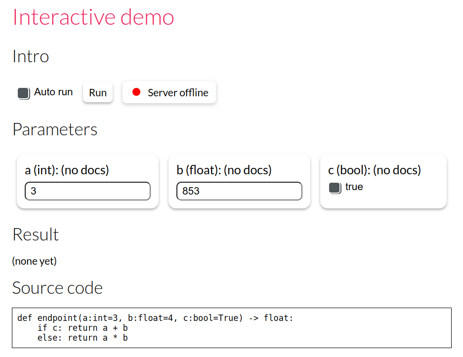

k1lib.serve module
------------------

This module is for quickly serving Python functions in an interactive website, so that
you can build interfaces for your experiments real quick. Let's say you have a
function in the file "a.py"::

   def endpoint(a:int=3, b:float=4, c:bool=True) -> float:
      if c: return a + b
      else: return a * b

You want to be able to expose a nice interactive interface so that you can present to
everyone, or to be used in other systems, then you can do something like this::

   cbs = k1.Callbacks()
   cbs.add(serve.FromPythonFile("a.py"))
   cbs.add(serve.BuildPythonFile(port=5138))
   cbs.add(serve.StartServer())
   cbs.add(serve.GenerateHtml(htmlFile="index.html"))

   serve.serve(cbs)

This will start up a local server at the specified port (this case 5138), and dumps a
``index.html`` file in the current folder. Opening it up will give you this interface:

That's pretty much it. You can add in your own callbacks, to enable further integration
with your systems. You can also customize the given callbacks more.

Currently, these data types are supported, together with their appearance on the interface:

- int, float, str: text box
- bool: checkbox toggle
- bytes, :class:`PIL.Image.Image`: file upload
- :class:`k1lib.Range`: continuous slider
- :class:`range`: stepped slider
- :class:`list`: dropdown

See a few demo examples at https://mlexps.com/

.. automodule:: k1lib.serve.main
   :members:
   :undoc-members:
   :show-inheritance:
