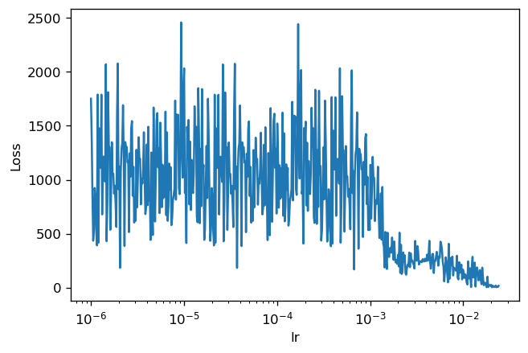
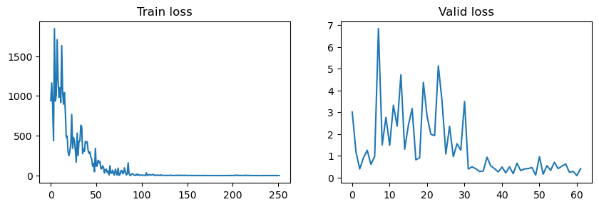
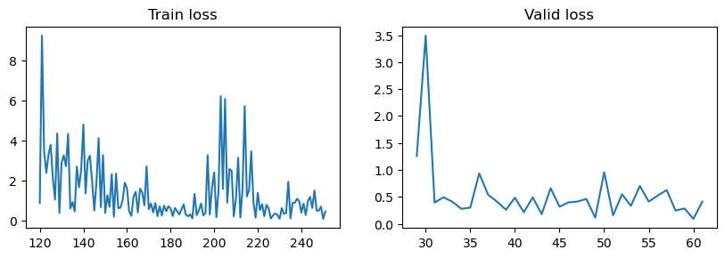
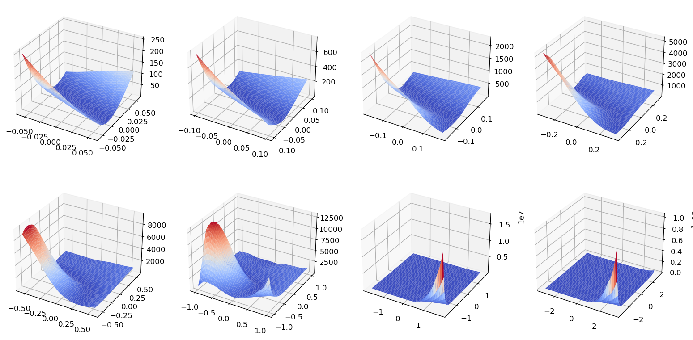
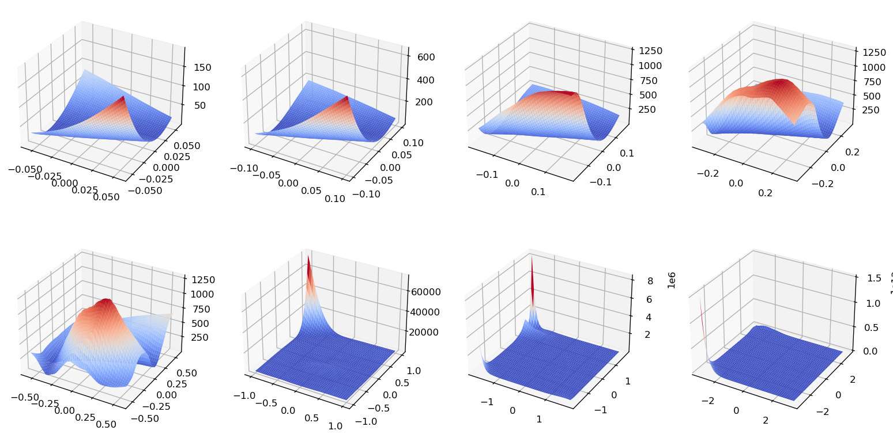
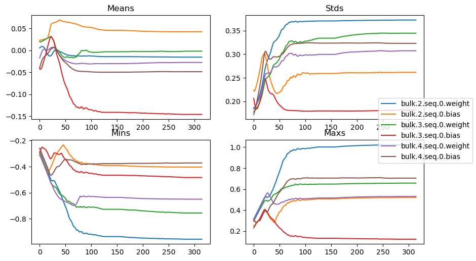
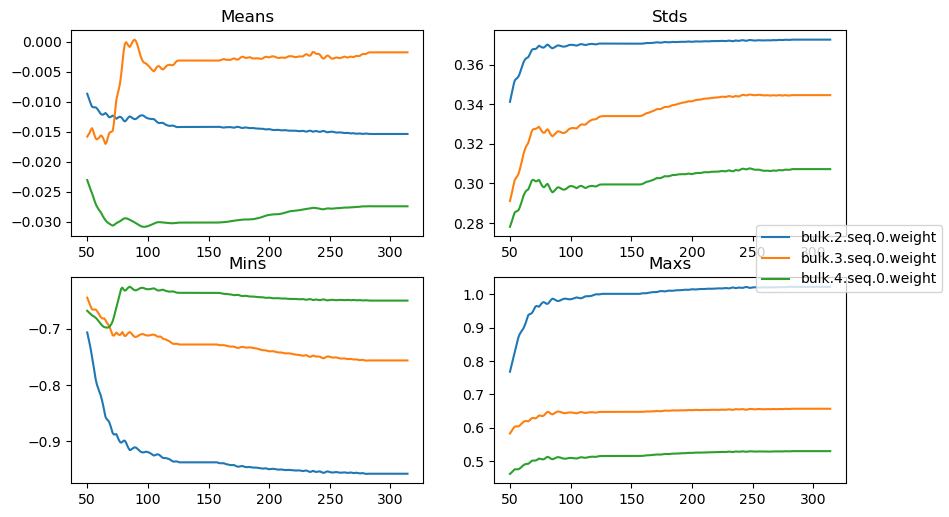
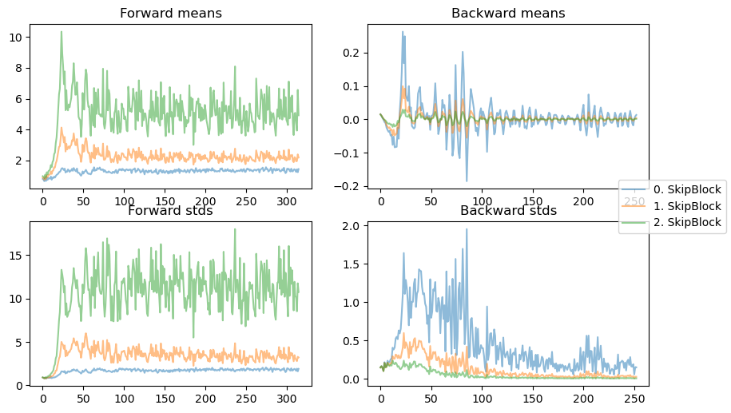

k1lib
=====

PyTorch is awesome, and it provides a very effective way to execute ML
code fast. What it lacks is surrounding infrastructure to make general
debugging and discovery process better. Other more official wrapper
frameworks sort of don’t make sense to me, so this is an attempt at
recreating a robust suite of tools that makes sense.

Table of contents: - `Overview <#overview>`__ -
`ParamFinder <#paramfinder>`__ - `Loss <#loss>`__ -
`LossLandscape <#loss-landscape>`__ - `HookParam <#hookparam>`__ -
`HookModule <#hookmodule>`__ - `CSS module
selector <#css-module-selector>`__ - `Data loader <#data-loader>`__ -
`Callbacks <#callbacks>`__

Let’s see an example:

Overview
--------

.. code:: ipython3

    from k1lib.imports import *


.. raw:: html

    <style>div.jp-OutputArea-output pre {white-space: pre;}</style>


.. raw:: html

    <style>div.output_area pre {white-space: pre;}</style>


```k1lib.imports`` <k1lib/imports.py>`__ is just a file that imports
lots of common utilities, so that importing stuff is easier and quicker.

.. code:: ipython3

    class SkipBlock(nn.Module):
        def __init__(self, hiddenDim=10):
            super().__init__()
            def gen(): return nn.Linear(hiddenDim, hiddenDim), nn.LeakyReLU()
            self.seq = nn.Sequential(*gen(), *gen(), *gen())
        def forward(self, x):
            return self.seq(x) + x

.. code:: ipython3

    class Network(nn.Module):
        def __init__(self, hiddenDim=10, blocks=3, block=SkipBlock):
            super().__init__()
            layers = [nn.Linear(1, hiddenDim), nn.LeakyReLU()]
            layers += [block(hiddenDim) for _ in range(blocks)]
            layers += [nn.Linear(hiddenDim, 1)]
            self.bulk = nn.Sequential(*layers)
        def forward(self, x):
            return self.bulk(x)

Here is our network. Just a normal feed-forward network, with skip
blocks in the middle.

.. code:: ipython3

    def newL(*args, **kwargs):
        l = k1lib.Learner()
        l.model = Network(*args, **kwargs)
        l.data = k1lib.data.Data.fromDataset(k1lib.data.FunctionDataset.exp, batchSize=64)
        l.opt = optim.Adam(l.model.parameters(), lr=1e-2)
        l.lossF = lambda x, y: ((x.squeeze() - y)**2).mean()
    
        l.cbs.withModifyBatch(lambda x, y: (x[:, None], y))
        l.cbs.withDType(torch.float32);
        l.cbs.withCancelOnLowLoss(1, epochMode=True)
        l.css = """SkipBlock #0: HookParam
    SkipBlock: HookModule"""
    
        def evaluate(self):
            xbs, ybs, ys = self.Recorder.record(1, 3)
            xbs = torch.vstack(xbs).squeeze()
            ybs = torch.vstack([yb[:, None] for yb in ybs]).squeeze()
            ys = torch.vstack(ys).squeeze()
            plt.plot(xbs, ys.detach(), ".")
        l.evaluate = partial(evaluate, l)
        return l
    l = newL()
    l.run(10);


.. parsed-literal::

    /home/kelvin/anaconda3/envs/torch/lib/python3.8/site-packages/torch/nn/modules/module.py:974: UserWarning: Using a non-full backward hook when the forward contains multiple autograd Nodes is deprecated and will be removed in future versions. This hook will be missing some grad_input. Please use register_full_backward_hook to get the documented behavior.
      warnings.warn("Using a non-full backward hook when the forward contains multiple autograd Nodes "


.. parsed-literal::

    Progress:  39%, epoch:  3/10, batch: 148/157, elapsed:   1.71s  Run cancelled: Low loss 1 ([4.137817813504126, 6.064462519461109, 1.03841807140458, 0.618931788109964] actual) achieved!.
    Saved to autosave-2.pth


Here is where things get a little more interesting. ``k1lib.Learner`` is
the main wrapper where training will take place. It has 4 basic
parameters that must be set before training: model, data loader,
optimizer, and loss function.

   **Tip**: docs are tailored for each object so you can do
   ``print(obj)`` or just ``obj`` in a code cell

.. code:: ipython3

    l.cbs


.. parsed-literal::

    Callbacks:
    - Autosave
    - CancelOnExplosion
    - CancelOnLowLoss
    - DType
    - DontTrainValid
    - HookModule
    - HookParam
    - Loss
    - LossLandscape
    - ModifyBatch
    - ParamFinder
    - Profiler
    - ProgressBar
    - Recorder
    
    Use...
    - cbs.append(cb[, name]): to add a callback with a name
    - cbs("startRun"): to trigger a specific event
    - cbs.Loss: to get a specific callback by name
    - cbs[i]: to get specific callback by index
    - cbs.timings: to get callback execution times
    - `with cbs.suspend(["Loss", "Cuda"]): pass`: to temporarily prevent triggering events in
        specific callbacks. Can be nested
    - cbs.restore(): to restore latest temporary suspension
    - cbs.withs: to get list of with- functions. Corresponding classes are in k1lib.Callback.cls


There’re lots of Callbacks. What they are will be discussed later, but
here’s a tour of a few of them:

ParamFinder
~~~~~~~~~~~

.. code:: ipython3

    l = newL(); l.ParamFinder.plot(samples=1000)[:0.99]


.. parsed-literal::

    Progress:   0%, epoch:    3/1000, batch:  78/157, elapsed:   1.25s  Run cancelled: Loss increases significantly.
    Suggested param: 0.011785347069983639





.. parsed-literal::

    Sliceable plot. Can...
    - p[a:b]: to focus on a specific range of the plot
    - p.yscale("log"): to perform operation as if you're using plt
    
    Reminder: slice range here is actually [0, 1], because it's kinda hard to slice the normal way


As advertised, this callback searches for a perfect parameter for the
network.

Loss
~~~~

.. code:: ipython3

    l = newL(); l.run(10); l.Loss


.. parsed-literal::

    /home/kelvin/anaconda3/envs/torch/lib/python3.8/site-packages/torch/nn/modules/module.py:974: UserWarning: Using a non-full backward hook when the forward contains multiple autograd Nodes is deprecated and will be removed in future versions. This hook will be missing some grad_input. Please use register_full_backward_hook to get the documented behavior.
      warnings.warn("Using a non-full backward hook when the forward contains multiple autograd Nodes "


.. parsed-literal::

    Progress:  20%, epoch:  1/10, batch: 152/157, elapsed:   0.83s  Run cancelled: Low loss 1 ([2.2685133757129794, 0.42127063630088685] actual) achieved!.
    Saved to autosave-2.pth


.. parsed-literal::

    Callback `Loss`, use...
    - cb.train: for all training losses over all epochs and batches (#epochs * #batches)
    - cb.valid: for all validation losses over all epochs and batches (#epochs * #batches)
    - cb.plot(): to plot the 2 above
    - cb.epoch: for average losses of each epochs
    - cb.something: to get specific attribute "something" from learner if not available
    - cb.withCheckpoint(checkpoint, f): to quickly insert an event handler
    - cb.detach(): to remove itself from its parent Callbacks


.. code:: ipython3

    l.Loss.plot()





.. parsed-literal::

    Sliceable plot. Can...
    - p[a:b]: to focus on a specific range of the plot
    - p.yscale("log"): to perform operation as if you're using plt
    
    Reminder: the actual slice you put in is for the training plot. The valid loss's plot will update automatically to be in the same time frame


Data type returned is ``k1lib.viz.SliceablePlot``, so you can zoom the
plot in a specific range, like this:

.. code:: ipython3

    l.Loss.plot()[120:]





.. parsed-literal::

    Sliceable plot. Can...
    - p[a:b]: to focus on a specific range of the plot
    - p.yscale("log"): to perform operation as if you're using plt
    
    Reminder: the actual slice you put in is for the training plot. The valid loss's plot will update automatically to be in the same time frame


Notice how original train range is ``[0, 250]``, and valid range is
``[0, 60]``. When sliced with ``[120:]``, train’s range sliced as
planned from the middle to end, and valid’s range adapting and also
sliced from middle to end (``[30:]``).

LossLandscape
~~~~~~~~~~~~~

.. code:: ipython3

    l.LossLandscape.plot()


.. parsed-literal::

    
    Progress: 100%          8/8 Finished [-3.16, 3.16] range                        





.. code:: ipython3

    l.LossLandscape.plot()


.. parsed-literal::

    
    Progress: 100%          8/8 Finished [-3.16, 3.16] range                        





Oh and yeah, this callback can give you a quick view into how the
landscape is. The center point (0, 0) is always the lowest portion of
the landscape, so that tells us the network has learned stuff.

HookParam
~~~~~~~~~

.. code:: ipython3

    l.HookParam


.. parsed-literal::

    Callback `HookParam`: 6 params, 315 means and stds each:
      0. bulk.2.seq.0.weight
      1. bulk.2.seq.0.bias
      2. bulk.3.seq.0.weight
      3. bulk.3.seq.0.bias
      4. bulk.4.seq.0.weight
      5. bulk.4.seq.0.bias
    
    Use...
    - p.plot(): to quickly look at everything
    - p[i]: to view a single param
    - p[a:b]: to get a new HookParam with selected params
    - p.css("..."): to select a specific subset of modules only
    - cb.something: to get specific attribute "something" from learner if not available
    - cb.withCheckpoint(checkpoint, f): to quickly insert an event handler
    - cb.detach(): to remove itself from its parent Callbacks


.. code:: ipython3

    l.HookParam.plot()





.. parsed-literal::

    Sliceable plot. Can...
    - p[a:b]: to focus on a specific range of the plot
    - p.yscale("log"): to perform operation as if you're using plt


This tracks parameters’ means, stds, mins and maxs while training. You
can also display only certain number of parameters:

.. code:: ipython3

    l.HookParam[::2].plot()[50:]





.. parsed-literal::

    Sliceable plot. Can...
    - p[a:b]: to focus on a specific range of the plot
    - p.yscale("log"): to perform operation as if you're using plt


HookModule
~~~~~~~~~~

.. code:: ipython3

    l.HookModule.plot()





.. parsed-literal::

    Sliceable plot. Can...
    - p[a:b]: to focus on a specific range of the plot
    - p.yscale("log"): to perform operation as if you're using plt


Pretty much same thing as before. This callback hooks into selected
modules, and captures the forward and backward passes. Both
``HookParam`` and ``HookModule`` will only hook into selected modules
(by default all is selected):

.. code:: ipython3

    l.selector


.. parsed-literal::

    ModuleSelector:
    root: Network                       
        bulk: Sequential                
            0: Linear                       
            1: LeakyReLU                    
            2: SkipBlock                HookModule
                seq: Sequential         
                    0: Linear           HookParam    
                    1: LeakyReLU            
                    2: Linear               
                    3: LeakyReLU            
                    4: Linear               
                    5: LeakyReLU            
            3: SkipBlock                HookModule
                seq: Sequential         
                    0: Linear           HookParam    
                    1: LeakyReLU            
                    2: Linear               
                    3: LeakyReLU            
                    4: Linear               
                    5: LeakyReLU            
            4: SkipBlock                HookModule
                seq: Sequential         
                    0: Linear           HookParam    
                    1: LeakyReLU            
                    2: Linear               
                    3: LeakyReLU            
                    4: Linear               
                    5: LeakyReLU            
            5: Linear                       
    
    Can...
    - mS.displayF = ...: sets a display function (mS -> str) for self and all descendants. Defaults to displaying all props
    - mS.deepestDepth: get deepest depth possible
    - mS.nnModule: get the underlying nn.Module object
    - mS.apply(f): apply to self and all descendants
    - mS.copy(): copy everything, including descendants
    - mS.selected("HookModule"): whether this module has a specified prop
    - mS.highlight(prop): highlights all modules with specified prop
    - mS.parse([..., ...]): parses extra css
    - mS.clearProps(): to clear all selected props, including descendants
    - mS.directParams(): get Dict[str, nn.Parameter] that are directly under this module
    - mS.named_children(), mS.children(): like PyTorch
    - mS.named_modules([prop]), mS.modules([prop]): like PyTorch. Optional filter prop
    - mS.parameters(): like PyTorch


CSS module selector
-------------------

You can select specific modules by setting ``l.css = ...``, kinda like
this:

.. code:: ipython3

    l = newL()
    l.css = """
    #bulk > Linear: a
    #bulk > #1: b
    SkipBlock Sequential: c
    SkipBlock LeakyReLU
    """
    l.selector


.. parsed-literal::

    ModuleSelector:
    root: Network                       
        bulk: Sequential                
            0: Linear                   a    
            1: LeakyReLU                b    
            2: SkipBlock                
                seq: Sequential         c
                    0: Linear               
                    1: LeakyReLU        all    
                    2: Linear               
                    3: LeakyReLU        all    
                    4: Linear               
                    5: LeakyReLU        all    
            3: SkipBlock                
                seq: Sequential         c
                    0: Linear               
                    1: LeakyReLU        all    
                    2: Linear               
                    3: LeakyReLU        all    
                    4: Linear               
                    5: LeakyReLU        all    
            4: SkipBlock                
                seq: Sequential         c
                    0: Linear               
                    1: LeakyReLU        all    
                    2: Linear               
                    3: LeakyReLU        all    
                    4: Linear               
                    5: LeakyReLU        all    
            5: Linear                   a    
    
    Can...
    - mS.displayF = ...: sets a display function (mS -> str) for self and all descendants. Defaults to displaying all props
    - mS.deepestDepth: get deepest depth possible
    - mS.nnModule: get the underlying nn.Module object
    - mS.apply(f): apply to self and all descendants
    - mS.copy(): copy everything, including descendants
    - mS.selected("HookModule"): whether this module has a specified prop
    - mS.highlight(prop): highlights all modules with specified prop
    - mS.parse([..., ...]): parses extra css
    - mS.clearProps(): to clear all selected props, including descendants
    - mS.directParams(): get Dict[str, nn.Parameter] that are directly under this module
    - mS.named_children(), mS.children(): like PyTorch
    - mS.named_modules([prop]), mS.modules([prop]): like PyTorch. Optional filter prop
    - mS.parameters(): like PyTorch


Essentially, you can: - #a: to select modules with name “a” - b: to
select modules with class name “b” - a #b: to select modules with name
“b” under modules with class “a” - a > #b: to select modules with name
“b” directly under modules with class “a” - “#a: infinity war”: to
assign selected module with properties “infinity” and “war”

Different callbacks will recognize certain props. ``HookModule`` will
hook all modules with props “all” or “HookModule”. Likewise,
``HookParam`` will hook all parameters with props “all” or “HookParam”.

Data loader
-----------

.. code:: ipython3

    l.data


.. parsed-literal::

    `Data` object, just a shell containing 2 `DataLoader`s: `.train` and `.valid`


.. code:: ipython3

    l.data.train


.. parsed-literal::

    DataLoader object. 126 batches total, can...
    - len(dl): to get number of batches the sampler has
    - dl[:80]: to get a new DataLoader with only the first 80 batches
    - dl[2]: to get the third batch
    - for data in dl: print(data)
    - it = iter(dl); data = next(it)


It’s simple, really! ``l.data`` contains a ``train`` and ``valid`` data
loader and each has multiple ways to unpack values.

Callbacks
---------

Let’s look at ``l`` again:

.. code:: ipython3

    l


.. parsed-literal::

    l.model:
        Network(
          (bulk): Sequential(
            (0): Linear(in_features=1, out_features=10, bias=True)
            (1): LeakyReLU(negative_slope=0.01)
            (2): SkipBlock(
              (seq): Sequential(
                (0): Linear(in_features=10, out_features=10, bias=True)
                (1): LeakyReLU(negative_slope=0.01)
                (2): Linear(in_features=10, out_features=10, bias=True)
                (3): LeakyReLU(negative_slope=0.01)
        .....
    l.opt:
        Adam (
        Parameter Group 0
            amsgrad: False
            betas: (0.9, 0.999)
            eps: 1e-08
            lr: 0.01
            weight_decay: 0
        )
    l.cbs:
        Callbacks:
        - Autosave
        - CancelOnExplosion
        - CancelOnLowLoss
        - DType
        - DontTrainValid
        - HookModule
        - HookParam
        - Loss
        - LossLandscape
        .....
    Use...
    - l.model = ...: to specify a nn.Module object
    - l.data = ...: to specify data object
    - l.opt = ...: to specify an optimizer
    - l.lossF = ...: to specify a loss function
    - l.css = ...: to select modules using CSS. "#root" for root model
    - l.cbs = ...: to use a custom `Callbacks` object
    - l.selector: to get the modules selected by `l.css`
    - l.run(epochs): to run the network
    - l.Loss: to get a specific callback, this case "Loss"


``l.model`` and ``l.opt`` is simple enough. It’s just PyTorch’s
primitives. The part where most of the magic lies is in ``l.cbs``, an
object of type ``k1lib.Callbacks``, a container object of
``k1lib.Callback``. Notice the final “s” in the name.

A callback is pretty simple. While training, you may want to sort of
insert functionality here and there. Let’s say you want the program to
print out a progress bar after each epoch. You can edit the learning
loop directly, with some internal variables to keep track of the current
epoch and batch, like this:

.. code:: python

   startTime = time.time()
   for epoch in epochs:
       for batch in batches:
           # do training
           data = getData()
           train(data)
           
           # calculate progress
           elapsedTime = time.time() - startTime
           progress = round((batch / batches + epoch) / epochs * 100)
           print(f"\rProgress: {progress}%, elapsed: {round(elapsedTime, 2)}s         ", end="")

But this means when you don’t want that functionality anymore, you have
to know what internal variable belongs to the progress bar, and you have
to delete it. With callbacks, things work a little bit differently:

.. code:: python

   class ProgressBar(k1lib.Callback):
       def startRun(self):
           pass
       def startBatch(self):
           self.progress = round((self.batch / self.batches + self.epoch) / self.epochs * 100)
           a = f"Progress: {self.progress}%"
           b = f"epoch: {self.epoch}/{self.epochs}"
           c = f"batch: {self.batch}/{self.batches}"
           print(f"{a}, {b}, {c}")

   class Learner:
       def run(self):
           self.epochs = 1; self.batches = 10

           self.cbs = k1lib.Callbacks()
           self.cbs.append(ProgressBar())

           self.cbs("startRun")
           for self.epoch in self.epochs:
               self.cbs("startEpoch")
               for self.batch in self.batches:
                   self.xb, self.yb = getData()
                   self.cbs("startBatch")

                   # do training
                   self.y = self.model(data); self.cbs("endPass")
                   self.loss = self.lossF(self.y); self.cbs("endLoss")
                   if self.cbs("startBackward"): self.loss.backward()

                   self.cbs("endBatch")
               self.cbs("endEpoch")
           self.cbs("endRun")

This is a stripped down version of ``k1lib.Learner``, to get the idea
across. Point is, whenever you do ``self.cbs("startRun")``, it will run
through all ``k1lib.Callback`` that it has (``ProgressBar`` in this
example), check if it implements ``startRun``, and if yes, executes it.

Inside ``ProgressBar``\ ’s ``startBatch``, you can access learner’s
current epoch by doing ``self.learner.epoch``. But you can also do
``self.epoch`` alone. If the attribute is not defined, then it will
automatically be searched inside ``self.learner``.

As you can see, if you want to get rid of the progress bar without using
``k1lib.Callbacks``, you have to delete the ``startTime`` line and the
actual calculate progress lines. This requires you to remember which
lines belongs to which functionality. If you use the ``k1lib.Callbacks``
mechanism instead, then you can just uncomment
``self.cbs.append(ProgressBar())``, and that’s it. This makes swapping
out components extremely easy, repeatable, and beautiful.

Other use cases include intercepting at ``startBatch``, and push all the
training data to the GPU. You can also reshape the data however you
want. You can insert different loss mechanisms (``endLoss``) in addition
to ``lossF``, or quickly inspect the model output. You can also change
learning rates while training (``startEpoch``) according to some
schedules. The possibility are literally endless.

